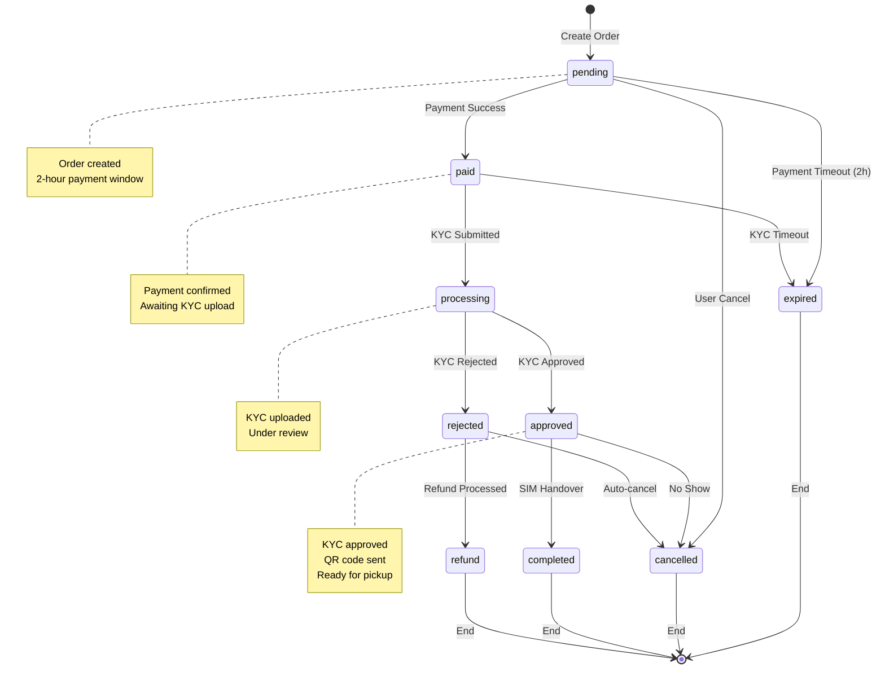
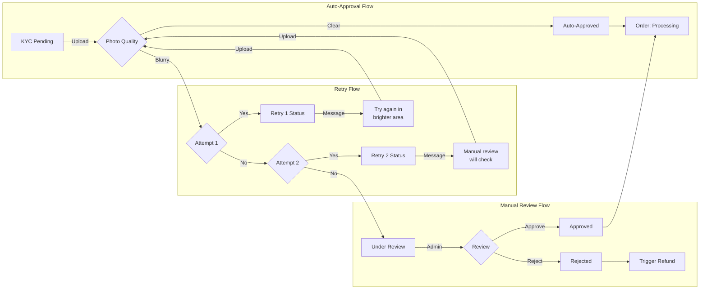
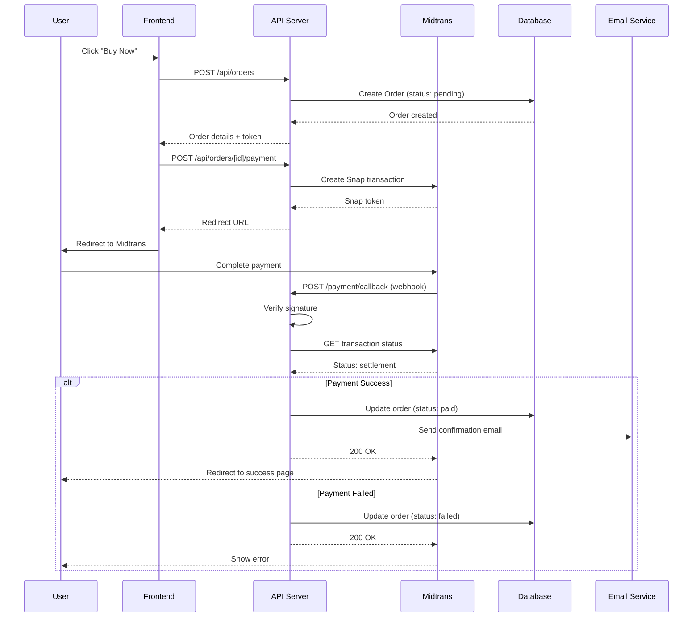
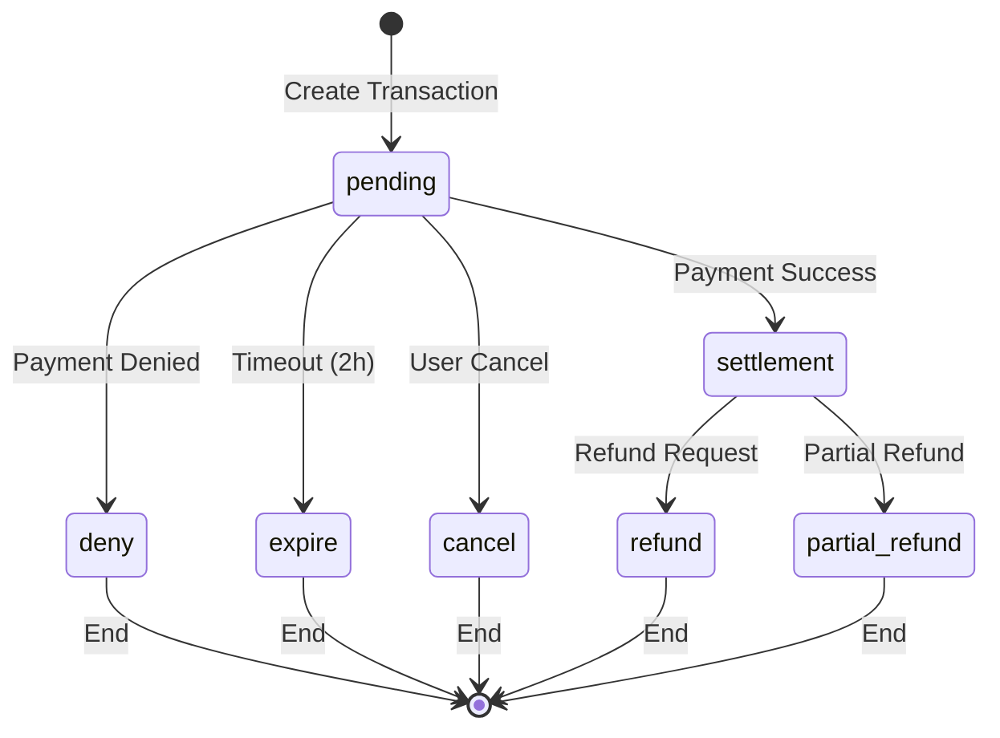
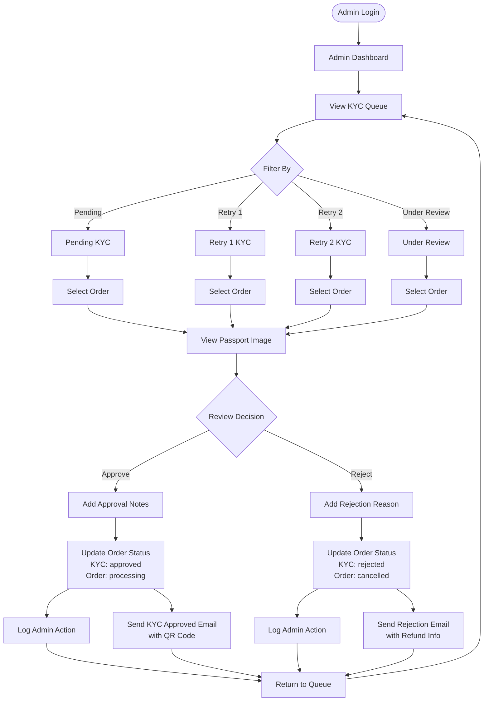
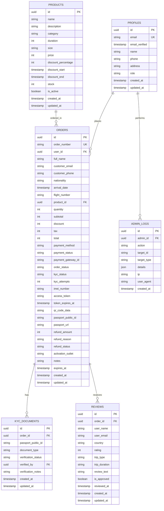

# badekshop - Flow Diagrams

This document contains visual flow diagrams for the badekshop platform using Mermaid syntax.

---

## Table of Contents

1. [User Purchase Flow](#1-user-purchase-flow)
2. [Order Status Flow](#2-order-status-flow)
3. [KYC Status Flow](#3-kyc-status-flow)
4. [Payment Flow](#4-payment-flow)
5. [Admin KYC Approval Flow](#5-admin-kyc-approval-flow)
6. [Database ERD](#6-database-erd)

---

## 1. User Purchase Flow

```mermaid
flowchart TD
    Start([User Visits Website]) --> Landing[Landing Page]
    Landing --> Browse[Browse Products]
    Browse --> Select{Select Package}
    Select -->|eSIM| eSIMForm[Checkout Form]
    Select -->|SIM Card| SIMForm[Checkout Form]
    
    eSIMForm --> FillForm[Fill: Name, Email, Phone,<br/>Nationality, Arrival Date,<br/>Flight Number, IMEI]
    SIMForm --> FillForm
    
    FillForm --> Payment[Redirect to Midtrans]
    Payment --> PaymentCheck{Payment Status}
    
    PaymentCheck -->|Success| OrderSuccess[Order Created<br/>Payment Status: Paid]
    PaymentCheck -->|Failed| PaymentRetry{Retry?}
    
    PaymentRetry -->|Yes (Max 3)| Payment
    PaymentRetry -->|No / Expired| OrderExpired[Order Expired<br/>2-hour window]
    OrderExpired --> End1([End])
    
    OrderSuccess --> KYCForm[KYC Upload Form]
    KYCForm --> UploadDoc[Upload Passport + IMEI]
    UploadDoc --> PhotoCheck{Photo Quality}
    
    PhotoCheck -->|Clear| AutoApprove[KYC Auto-Approved]
    PhotoCheck -->|Blurry| RetryCheck{Attempt Count}
    
    RetryCheck -->|1st| Retry1[Show Retry 1 Message<br/>Educational guidance]
    RetryCheck -->|2nd| Retry2[Show Retry 2 Message<br/>Manual review pending]
    RetryCheck -->|3rd| UnderReview[KYC Under Review]
    
    Retry1 --> UploadDoc
    Retry2 --> UploadDoc
    
    UnderReview --> ManualReview{Admin Review}
    ManualReview -->|Approve| AutoApprove
    ManualReview -->|Reject| KYCRejected[KYC Rejected]
    
    AutoApprove --> QRCode[Generate QR Code]
    QRCode --> SendEmail[Send KYC Approved Email<br/>with QR Code]
    
    KYCRejected --> RefundProcess[Trigger Refund]
    RefundProcess --> End2([End])
    
    SendEmail --> Arrival{User Arrives}
    Arrival -->|24h Before| Reminder[Send Pickup Reminder]
    Reminder --> ShowQR[Show QR at Airport]
    
    Arrival -->|Direct| ShowQR
    ShowQR --> Verify[Staff Verifies Identity]
    Verify --> Handover[Hand Over SIM Card]
    Handover --> Complete[Order Completed]
    Complete --> FollowUp[Send Follow-up Email<br/>Review Invitation]
    FollowUp --> End3([End])
```

### Flow Description

| Step | Action | System Response |
|------|--------|----------------|
| 1-3 | User browses and selects package | Show product details |
| 4 | Fill checkout form | Validate inputs |
| 5 | Payment via Midtrans | 2-hour payment window |
| 6 | KYC upload | Auto-approval or retry |
| 7 | QR code generation | Email sent to customer |
| 8 | Airport pickup | Staff verification |
| 9 | Completion | Follow-up email |

---

## 2. Order Status Flow



### Status Definitions

| Status | Description | Next Possible |
|--------|-------------|---------------|
| `pending` | Order created, awaiting payment | paid, expired, cancelled |
| `paid` | Payment successful, awaiting KYC | processing, expired |
| `processing` | KYC uploaded, under review | approved, rejected |
| `approved` | KYC approved, ready for pickup | completed, cancelled |
| `rejected` | KYC rejected, refund pending | cancelled, refund |
| `completed` | SIM handed over, order done | - |
| `cancelled` | Order cancelled | - |
| `expired` | Payment/KYC timeout | - |

---

## 3. KYC Status Flow



### KYC Status Transitions

| Current Status | Condition | Next Status |
|----------------|-----------|-------------|
| `pending` | Upload clear photo | `auto_approved` |
| `pending` | 1st blurry upload | `retry_1` |
| `retry_1` | 2nd blurry upload | `retry_2` |
| `retry_1` | Clear photo | `auto_approved` |
| `retry_2` | 3rd blurry upload | `under_review` |
| `retry_2` | Clear photo | `auto_approved` |
| `under_review` | Admin approves | `approved` |
| `under_review` | Admin rejects | `rejected` |
| `auto_approved` | - | `approved` (auto) |

---

## 4. Payment Flow



### Payment States



---

## 5. Admin KYC Approval Flow



### Admin Actions

| Action | API Endpoint | Effect |
|--------|--------------|--------|
| View KYC List | `GET /api/admin/kyc` | List pending documents |
| View Order Detail | `GET /api/admin/orders/[id]` | Full order info |
| Approve KYC | `PUT /api/admin/orders/[id]/kyc` | Status → approved |
| Reject KYC | `PUT /api/admin/orders/[id]/kyc` | Status → rejected |
| Update Status | `PUT /api/admin/orders/[id]/status` | Manual status change |

---

## 6. Database ERD



### Table Relationships

| Table | Foreign Keys | Description |
|-------|--------------|-------------|
| **orders** | user_id → profiles.id, product_id → products.id | Links user and product |
| **kyc_documents** | order_id → orders.id, verified_by → profiles.id | Links to order and admin |
| **reviews** | order_id → orders.id | Links to order |
| **admin_logs** | admin_id → profiles.id | Links to admin user |

---

## 7. Email Workflow Timeline

```mermaid
gantt
    title Email Automation Timeline
    dateFormat X
    axisFormat %s
    
    section Order Flow
    Order Created           :0, 1
    Payment Success         :1, 2
    Order Confirmation Email :2, 3
    
    section KYC Flow
    KYC Upload              :3, 4
    KYC Approval            :4, 5
    KYC Approved Email      :5, 6
    
    section Pickup
    Arrival Date            :100, 101
    24h Before Reminder     :99, 100
    Pickup Complete         :101, 102
    
    section Post-Purchase
    Order Completed         :102, 103
    3 Days After            :105, 106
    Follow-up Email         :106, 107
```



### Email Triggers

| Email | Trigger | Timing |
|-------|---------|--------|
| Order Confirmation | Payment success | Immediate |
| KYC Approved | KYC status → approved | Immediate |
| Pickup Reminder | Arrival date - 24h | Scheduled |
| Follow-up Review | Order completion + 3 days | Scheduled |

---

## Usage Notes

### Viewing Diagrams

These diagrams use **Mermaid** syntax and can be viewed in:
1. **GitHub**: Native support (renders automatically)
2. **VS Code**: Install "Markdown Preview Mermaid Support" extension
3. **Online**: https://mermaid.live
4. **Documentation**: Most modern documentation platforms support Mermaid

### Exporting Diagrams

To export as images:
```bash
# Using Mermaid CLI
npm install -g @mermaid-js/mermaid-cli
mmdc -i FLOW_DIAGRAM.md -o diagrams/
```

---

*Last Updated: April 2026*
*Version: 1.0*
